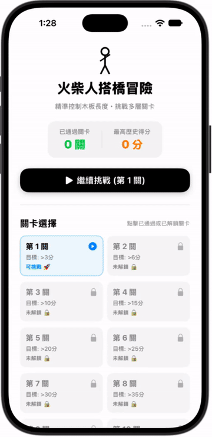
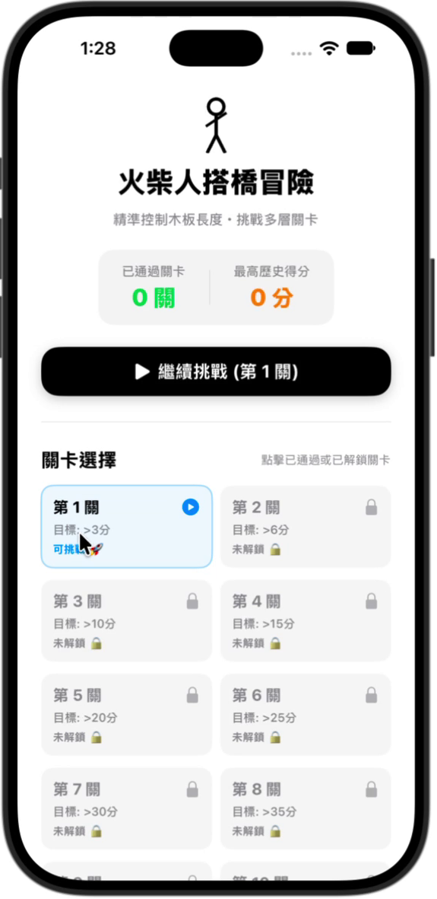
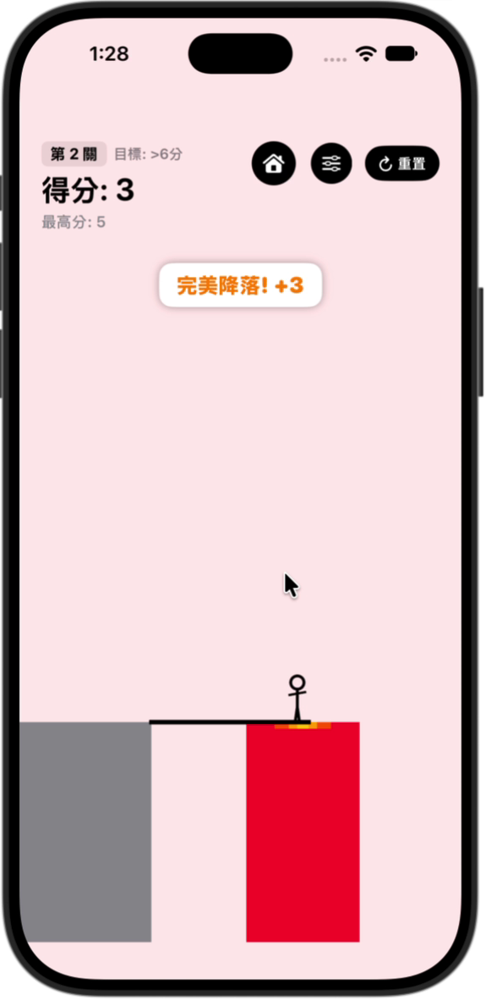
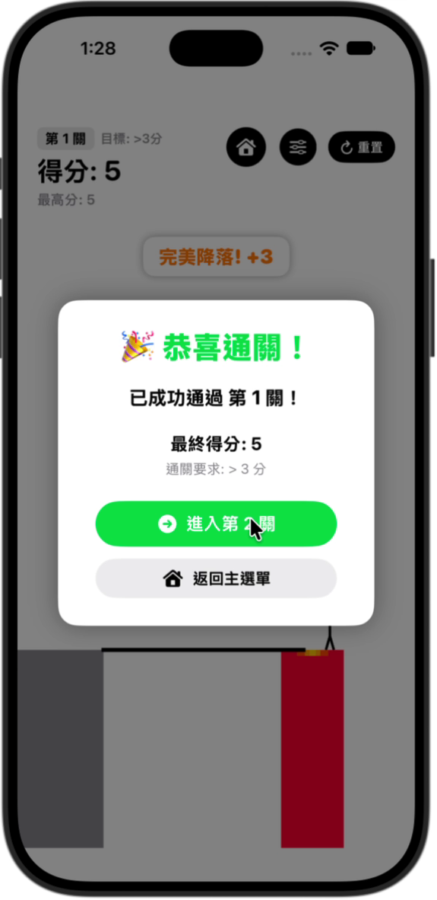

# 火柴人搭橋冒險 · MyFirstIOSProject

SwiftUI 搭橋小遊戲：長按控制木板長度，放手讓火柴人跨越平台；木板過長時，可在行走途中點按剪短。

> 版本說明：依據 2026-09-26 核對的 main 分支 ae21cd8（最終版本）整理。圖片及操作片段來自 2026-09-23 的實際錄影；最新程式已包含錄影中的主選單、選關、通關及進度保存。

## 操作展示

[44 秒操作影片](media/gameplay.mp4)

| 主選單 | 遊戲畫面 | 通關 |
| --- | --- | --- |
|  |  |  |

圖片與影片由真實錄影裁切取得，非模擬畫面。

## 目前公開程式的功能

- 長按畫面下半部伸長木板，放開後旋轉落下。
- 以木板末端與目標平台範圍判斷成功、過短、過長。
- 三層中央落點區域：10% 得 4 分、25% 得 3 分、50% 得 2 分，其餘成功得 1 分；採最高符合區域，分數不疊加。
- 木板過長時可在行走途中補救；每次剪短原長度的 2%，最少 1 個座標單位，且受角色腳下位置限制。
- 本回合實際剪短過木板，成功固定得 1 分。
- 每次成功後提升行走速度，可調整增幅。
- 可調起始平台寬度與平台寬度變動幅度。
- 失敗畫面、重新開始、鏡頭平移及火柴人步行動畫。

以 @AppStorage 保存最高分、已通過最高關卡與已解鎖關卡。保存的是關卡進度，不含進行中一局的角色位置或分數。

## 主選單、關卡與進度

主選單 → 已解鎖關卡 → 遊戲 → 通關／失敗 → 下一關／重試／主選單。

選關頁列出第 1～10 關，門檻分別為大於 3、6、10、15、20、25、30、35、40、50 分。角色抵達目標平台後才判斷是否通關；必須按下下一關按鈕才繼續。背景隨關卡提高逐漸變紅。

程式仍可從第 10 關繼續前進，未配置的關卡採用「關卡編號 × 5」門檻；選關網格目前僅列到第 10 關。

## 開啟專案

1. 將本 repository 下載到 Mac。
2. 使用 Xcode 開啟 MyFirstProject.xcodeproj。
3. 選擇 MyFirstProject scheme 與相容的 iOS 模擬器後執行。
4. 若使用實機，請在 Signing & Capabilities 選擇自己的開發團隊。

目前 project.pbxproj 的 iOS deployment target 設為 27.0，請使用支援此設定的 SDK／執行環境。本文整理環境沒有 Xcode，未重新建置或執行 App；既有對話中的 build 成功描述屬於先前開發紀錄。

## 程式結構

- MyFirstProject/MyApp.swift：App 進入點。
- MyFirstProject/ContentView.swift：遊戲畫面、狀態、計分、補救與鏡頭移動。
- MyFirstProject/Assets.xcassets：目前僅看到目錄設定與 AccentColor，尚無已配置圖片或 App Icon。
- conversation.txt：玩法調整的 AI 對話。
- AntigravityBackup/：AI 協作備份。

## AI 協作紀錄

[conversation.txt](conversation.txt) 記錄三層精準加分、剪木板時機修正、補救計分、回合旗標重置與速度遞增等調整。

## 作業尚待補齊

- 設定 App Icon 與正式 App 顯示名稱。
- 加入並展示本機圖片、網路圖片與客製字體。
- 補上每個開發版本的畫面截圖。

作業題目：[使用 AI 創作人生第一個 App](https://medium.com/p/934495e1a28d)。

本 README 與配套 media 資料夾由 AI 協助整理；此檔仍是待加入 GitHub 的草稿。
